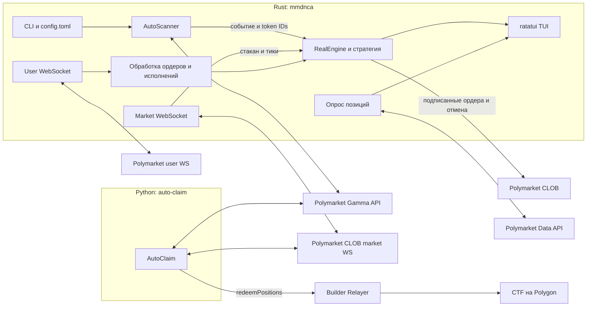

# MMDNA Bot

MMDNA Bot — набор инструментов для Polymarket: Rust-приложение для торговли на криптовалютных рынках Up/Down и отдельный Python-скрипт для автоматического получения выигрыша после разрешения рынка.

## Overview

Основная программа — асинхронный Rust-бот с интерактивным терминальным интерфейсом. Он ищет активные рынки через Polymarket Gamma API, получает стакан через CLOB WebSocket, рассчитывает сигналы выбранной стратегии и отправляет лимитные ордера через Polymarket CLOB. Состояние ордеров и исполнений поступает через пользовательский WebSocket, а позиции периодически запрашиваются через Data API.

В `src/redeem/claim.py` находится самостоятельная Python-программа. Она отслеживает 15-минутный рынок выбранной монеты, ждёт сообщения о победившем исходе и отправляет вызов `redeemPositions` через Polymarket Builder Relayer. Этот скрипт запускается отдельно и не вызывается из Rust-приложения.

Локальная база данных, очередь сообщений и Docker-конфигурация в репозитории отсутствуют. Состояние торговой сессии хранится в памяти; Rust-приложение пишет лог в `logs/app.log`.

## Features

- Поиск рынков BTC, ETH, SOL и XRP с интервалами 5 минут, 15 минут и 1 час в Rust-приложении.
- Режимы размещения первых ног `strong`, `weak`, `both`, `cumulative` и `math`. Режим `math` использует метрики дисбаланса стакана (OBI); `cumulative` ведёт цепочку первых ног.
- Обработка рыночных обновлений, ордеров и исполнений в реальном времени; отображение стакана, портфеля и открытых ордеров в TUI.
- Управление торговым режимом, отмена ордеров и ручная покупка UP/DOWN из интерфейса.
- Отдельный Python-цикл claim для 15-минутных рынков BTC, ETH, SOL и XRP.

## Tech Stack

### Rust-приложение

- Rust 2024 edition, Tokio для асинхронной работы.
- `polymarket-client-sdk` для CLOB, пользовательского WebSocket и Data API; `alloy` для локального signer на Polygon.
- `reqwest`, `tokio-tungstenite`, `serde`, `toml` для HTTP, WebSocket, сериализации и конфигурации.
- `ratatui` и `crossterm` для терминального интерфейса; `tracing` для логирования.

### Python claim-скрипт

- Python `>=3.14`; зависимости и версии закреплены в `uv.lock`.
- `aiohttp`, `websockets`, `web3.py`, `python-dotenv`.
- `py-builder-relayer-client`, `py-builder-signing-sdk` и `poly-eip712-structs` для Relayer и подписания.

### Внешние сервисы

- Polymarket Gamma API — поиск событий и рынков.
- Polymarket CLOB REST и WebSocket — торговые операции, стакан и события пользователя.
- Polymarket Data API — позиции.
- Polymarket Builder Relayer и Conditional Token Framework на Polygon — отправка claim-транзакций из Python.

## Architecture



Rust и Python используют общий Gamma API и адрес WebSocket рынка, но имеют отдельные точки входа и отдельные переменные окружения. Rust-бот подключается к production CLOB `https://clob.polymarket.com` и размещает ордера через SDK.

## Project Structure

```text
Cargo.toml, Cargo.lock       Rust-пакет mmdnca и зафиксированные зависимости
config.toml                  Торговые параметры Rust-приложения
pyproject.toml, uv.lock      Python-зависимости и lock-файл
.python-version              Версия Python для uv: 3.14
src/main.rs                  Точка входа, меню и запуск торговой сессии
src/core/                    Торговый движок, обработка ордеров и стратегии
src/core/math_strat/         OBI-метрики, решения и состояние math-стратегии
src/websocket/               Потоки данных рынка и пользовательских событий
src/ui/                      TUI, состояние интерфейса и отображение данных
src/utils/                   Загрузка config/env, Gamma-сканер и логирование
src/models.rs                Модели рынка, ордеров, портфеля и UI
src/redeem/claim.py          Точка входа отдельного Python claim-скрипта
src/redeem/constants.py      Адреса контрактов и URL для claim-скрипта
```

## Requirements / Prerequisites

- Rust toolchain с поддержкой Edition 2024 (Rust 1.85 или новее) и Cargo.
- Python 3.14 и `uv` — только для Python claim-скрипта.
- Доступ к сетевым сервисам Polymarket, перечисленным выше.
- Терминал с поддержкой интерактивного ввода для Rust TUI и обоих меню.

При сборке Rust на Debian/Ubuntu могут понадобиться системные OpenSSL headers и `pkg-config`, поскольку HTTP и WebSocket TLS-функции включают `native-tls`:

```bash
sudo apt-get install pkg-config libssl-dev
```

Пакеты OpenSSL для других ОС зависят от дистрибутива; см. [инструкции openssl-sys](https://docs.rs/openssl/latest/openssl/#automatic).

База данных, Redis и локальный RPC-узел для запуска по конфигурации проекта не требуются.

## Installation

Команды выполняются из корня репозитория. Перед первым запуском создайте локальный `.env` с нужными для выбранного приложения учётными данными (см. [Configuration](#configuration)). Файл `config.toml` уже содержит параметры Rust-бота.

### Быстрый запуск Rust-бота

```bash
cargo run --locked
```

Cargo соберёт бинарный файл и запустит меню. После настройки `.env` выберите `1. Start`, монету и длительность рынка.

### Подготовка Python-окружения

```bash
uv sync --locked
```

## Configuration

### Переменные окружения

Rust загружает `.env` через `dotenvy`; Python использует `python-dotenv`. В репозитории нет `.env.example`. Ниже приведены имена переменных, которые читаются исходным кодом. Заполните только блок нужного приложения; значения секретов в репозитории не хранятся.

Создайте `.env` в корне репозитория и заполните нужные строки своими учётными данными:

```dotenv
# Rust trading bot
POLYMARKET_API_KEY=
POLYMARKET_API_SECRET=
POLYMARKET_API_PASSPHRASE=
POLYMARKET_PRIVATE_KEY=
FUNDER_ADDRESS=
CLOB_WS_MARKET=wss://ws-subscriptions-clob.polymarket.com/ws/market

# Python auto-claim (нужен только для claim-скрипта)
POLYGON_PK=
POLY_API_KEY=
POLY_API_SECRET=
POLY_API_PASSPHRASE=
```

Пустые значения в примере нужно заменить перед запуском соответствующей программы.

| Variable | Required | Used by | Description | Default |
|----------|----------|---------|-------------|---------|
| `POLYMARKET_API_KEY` | Да | Rust | CLOB API key; код разбирает значение как UUID. | Нет |
| `POLYMARKET_API_SECRET` | Да | Rust | CLOB API secret. | Нет |
| `POLYMARKET_API_PASSPHRASE` | Да | Rust | CLOB API passphrase. | Нет |
| `POLYMARKET_PRIVATE_KEY` | Да | Rust | Приватный ключ локального Polygon signer; имя берётся из `PRIVATE_KEY_VAR` SDK ([документация константы](https://docs.rs/polymarket-client-sdk/0.3.1/polymarket_client_sdk/constant.PRIVATE_KEY_VAR.html)). | Нет |
| `FUNDER_ADDRESS` | Да | Rust | Адрес funder-кошелька, передаваемый CLOB-клиенту с типом подписи Gnosis Safe. | Нет |
| `CLOB_WS_MARKET` | Да | Rust | URL market WebSocket. В Python-константе проекта указан `wss://ws-subscriptions-clob.polymarket.com/ws/market`. | Нет |
| `RUST_LOG` | Нет | Rust | Фильтр уровня логов для `tracing`. | `warn,mmdnca=info` |
| `POLYGON_PK` | Для claim | Python | Приватный ключ, передаваемый Relayer-клиенту на Polygon (chain ID 137). | Пустая строка в коде |
| `POLY_API_KEY` | Для claim | Python | Builder API key. | Пустая строка в коде |
| `POLY_API_SECRET` | Для claim | Python | Builder API secret. | Пустая строка в коде |
| `POLY_API_PASSPHRASE` | Для claim | Python | Builder API passphrase. | Пустая строка в коде |

Имена ключей Rust и Python различаются: `POLYMARKET_*` используются Rust CLOB-клиентом, `POLY_*` — Python Builder Relayer-клиентом. Для успешной аутентификации и claim-операции заполните соответствующие значения. Не коммитьте `.env`; он уже включён в `.gitignore`.

### Торговые параметры `config.toml`

Файл читается по относительному пути `config.toml` из текущей рабочей директории. Меню редактирования Rust-приложения может сохранить изменения в этот файл.

| Parameter | Текущее значение | Назначение |
|-----------|------------------|------------|
| `max_balance` | `300.0` | Порог расходов в USD для обычной трендовой и cumulative-логики. Важно: проверка не применяется к `math`-ветке, которая сейчас используется по умолчанию. |
| `size` | `10.0` | Размер одного ордера в акциях. |
| `max_size_side` | `10.0` | Порог размера/перекоса стороны, используемый cumulative- и math-логикой. |
| `chain_links` | `10` | Число звеньев первой ноги в cumulative-стратегии. |
| `seconds_before_start` | `5` | Не начинать торговлю раньше заданного числа секунд после старта рынка. |
| `seconds_until_end` | `60` | Прекратить торговлю за заданное число секунд до окончания рынка. |
| `legs_strategy` | `"math"` | Стратегия: `strong`, `weak`, `both`, `cumulative` или `math`. |

`max_balance` и `size` обязательны при чтении TOML. Для остальных параметров код задаёт fallback, если ключ отсутствует: `max_size_side = 50.0`, `chain_links = 1`, `seconds_before_start = 20`, `seconds_until_end = 60`, `legs_strategy = "both"`. Значения в существующем `config.toml` имеют приоритет над fallback.

## Running the Project

### Rust trading bot

```bash
cargo run --release
```

Программа сначала загружает конфигурацию и аутентифицирует CLOB и пользовательский WebSocket-клиент; после этого показывает главное меню. Выберите `Start`, затем монету (BTC/ETH/SOL/XRP) и длительность рынка (5 минут/15 минут/1 час). Бот ищет подходящее событие через Gamma API и после его нахождения открывает TUI торговой сессии.

Режим `REAL RUN` отправляет подписанные ордера в production CLOB; отдельный paper/sandbox-режим в коде не настроен.

Клавиши во время торговой сессии:

| Key | Действие |
|-----|----------|
| `q` | Остановить текущую сессию и вернуться в главное меню. |
| `Space` | Переключить режим `STOP` / `REAL RUN`. |
| `c`, затем `x` | Войти в режим отмены; `x` отменяет все ордера и возвращает `STOP`. |
| `b` | Включить или выключить режим ручного hedge. |
| `u` / `d` | В режиме hedge начать ввод объёма покупки UP / DOWN; `y` подтверждает, `n` отменяет ввод. |
| `o` | Переключить панель OBI. |

Ручной hedge отправляет GTC BUY-лимитный ордер по цене `0.99`; код использует эту цену для попытки немедленного исполнения.

### Python auto-claim

Сначала установите зависимости и заполните Python-переменные Builder Relayer в `.env`, затем из корня репозитория запустите модуль:

```bash
uv sync --locked
uv run python -m src.redeem.claim
```

Скрипт покажет меню выбора BTC, ETH, SOL или XRP для 15-минутных рынков, затем будет искать события, ждать `winning_asset_id` в market WebSocket и отправлять `redeemPositions` через Relayer. `Ctrl+C` возвращает в меню выбора.

## Development

Основные команды Rust:

```bash
cargo fmt
cargo fmt -- --check
cargo check --locked
cargo build --release --locked
```

Для Python в проекте настроено управление зависимостями через `uv`; отдельных scripts для lint, type checking или форматирования в `pyproject.toml` нет.

## Testing

Rust-команда для запуска тестового harness:

```bash
cargo test --locked
```

## Build

Release-сборка Rust-приложения создаёт бинарный файл `target/release/mmdnca`:

```bash
cargo build --release --locked
./target/release/mmdnca
```
